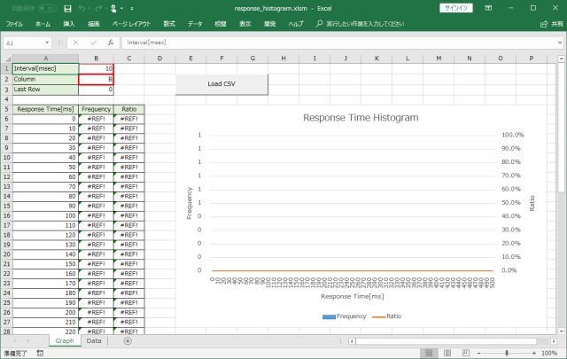
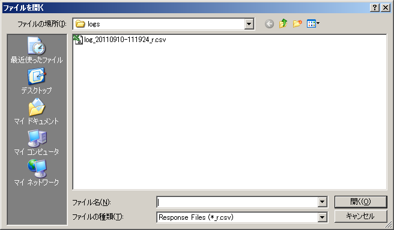
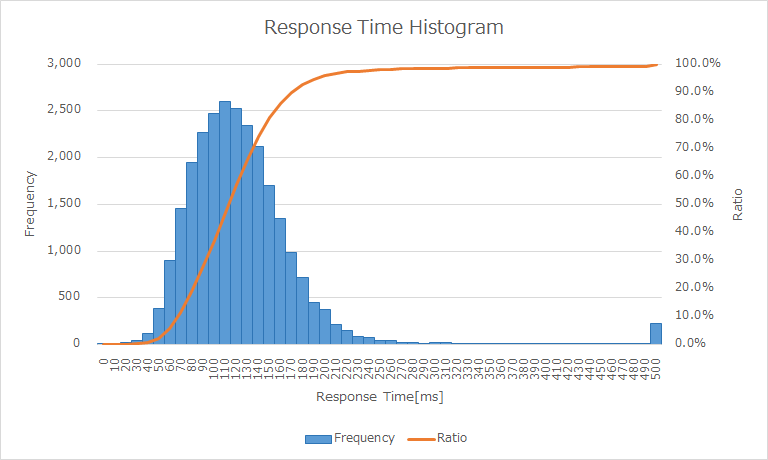
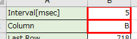
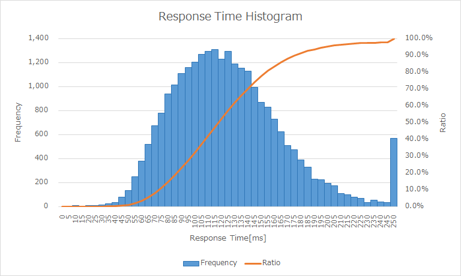

その他の付属ツール
==================

この章では、JdbcRunnerに付属するその他のツールについて説明します。

response_histogram.xlsm
-----------------------

miscディレクトリに、response_histogram.xlsmというExcelシートを用意しています。
これはレスポンスタイムのヒストグラムを作成するためのツールです。

このシートにはマクロが組み込まれています。
マクロの実行を許可したうえで、シート内のボタンを押してレスポンスタイムの度数分布データを読み込みます。

すると、以下のようなヒストグラムが描画されます。
棒グラフが階級ごとの度数、折れ線グラフが累積相対度数を表しています。

シート左上のパラメータで、階級の幅とグラフ化する列を変更できます。

例えば上記のデータで階級の幅を5ミリ秒に変更すると、グラフの見た目が以下のように変わります。

