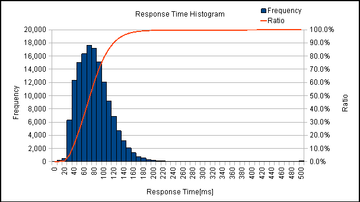
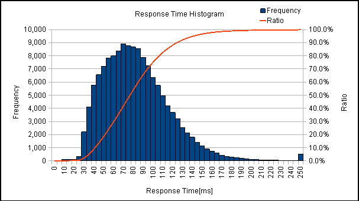

その他の付属ツール
==================

この章では、JdbcRunnerに付属するその他のツールについて説明します。

response_histogram.ods
----------------------

miscディレクトリに、response_histogram.odsというOpenOffice.orgまたはLibreOffice用の表計算シートを用意しています。これはレスポンスタイムのヒストグラムを作成するためのものです。

.. image:: images/response_sheet.png

このシートにはマクロが組み込まれています。マクロを実行するにはツール→オプション→OpenOffice.org→セキュリティ→マクロセキュリティを中または低に設定する必要があります。

シート内のボタンを押して、レスポンスタイムの度数分布データを読み込みます。

.. image:: images/response_open.png

すると、以下のようなヒストグラムが描画されます。棒グラフが階級ごとの度数、折れ線グラフが累積相対度数を表しています。

シート左上のパラメータで、階級の幅とグラフ化する列を変更することができます。

.. image:: images/response_change.png

例えば上記のデータで階級の幅を5ミリ秒に変更すると、以下のようになります。

