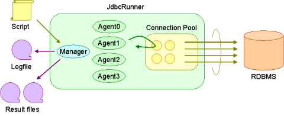
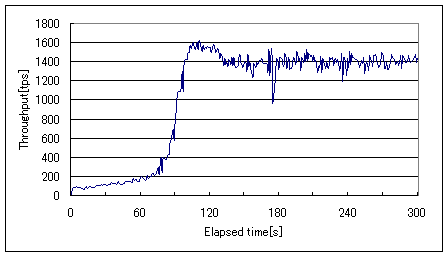
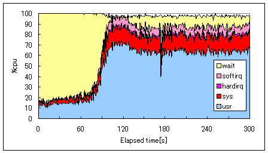
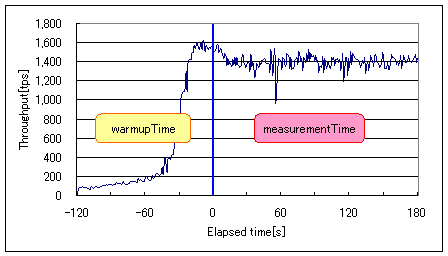
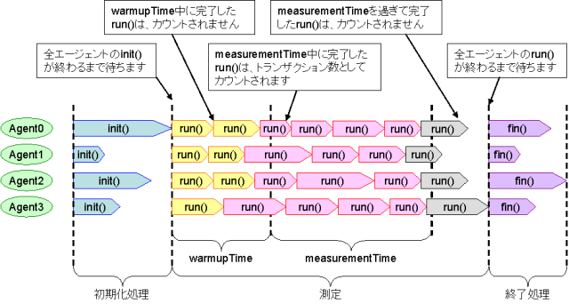
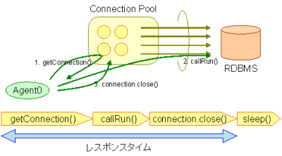

負荷テストの流れ
================

この章では、JdbcRunnerの構成と負荷テストの流れについて説明します。

JdbcRunnerの構成
----------------

JdbcRunnerの全体的な構成は、以下のようになっています。

* マネージャ : 負荷テスト全体を管理するスレッドです。ログファイルや結果ファイルの出力も行います
* エージェント : 負荷シナリオを実行するスレッドです。エージェントは複数存在しており、並列に動作します。実際にRDBMSにクエリを発行するのはこのエージェントの役割となります
* スクリプト : 負荷シナリオの処理内容を定義したスクリプトです

起動方法
--------

JdbcRunnerを起動するには、JRクラスを指定してjavaコマンドを実行します。1つ目のオプションにスクリプトのファイル名、2つ目以降のオプションに設定パラメータを指定します。設定パラメータは省略可能です。 ::

  > java JR <script> [options]

オプションなしで実行すると、簡単な使い方が表示されます。 ::

  > java JR
  
  JdbcRunner 1.2
  スクリプトファイルが指定されていません
  
  usage: java JR <script> [options]
  -autoCommit <arg>     オートコミットモードを有効化または無効化します (デフォルト : true (有効))
  -connPoolSize <arg>   コネクションプールの物理接続数を指定します (デフォルト : nAgents)
  -debug                デバッグモードを有効にします (デフォルト : false)
  -jdbcDriver <arg>     JDBCドライバのクラス名を指定します (デフォルト : (なし))
  -jdbcPass <arg>       データベースユーザのパスワードを指定します (デフォルト : (なし))
  -jdbcUrl <arg>        JDBC接続URLを指定します (デフォルト : jdbc:mysql://localhost:3306/test?useSSL=false&allowPublicKeyRetrieval=true)
  -jdbcUser <arg>       データベースのユーザ名を指定します (デフォルト : (なし))
  -logDir <arg>         ログの出力先ディレクトリを指定します (デフォルト : .)
  -measurementTime <arg>測定時間[sec]を指定します (デフォルト : 60)
  -nAgents <arg>        エージェント数を指定します (デフォルト : 1)
  -param0 <arg>         変数param0に値を設定します
  -param1 <arg>         変数param1に値を設定します
  -param2 <arg>         変数param2に値を設定します
  -param3 <arg>         変数param3に値を設定します
  -param4 <arg>         変数param4に値を設定します
  -param5 <arg>         変数param5に値を設定します
  -param6 <arg>         変数param6に値を設定します
  -param7 <arg>         変数param7に値を設定します
  -param8 <arg>         変数param8に値を設定します
  -param9 <arg>         変数param9に値を設定します
  -scriptCharset <arg>  スクリプトの文字セットを指定します
  -sleepTime <arg>      トランザクションごとのスリープ時間[msec]を指定します (デフォルト : 0)
  -stmtCacheSize <arg>  コネクションあたりの文キャッシュ数を指定します (デフォルト : 10)
  -throttle <arg>       スループットの上限値[tps]を指定します (デフォルト : 0 (無制限))
  -trace                トレースモードを有効にします (デフォルト : false)
  -warmupTime <arg>     測定前にあらかじめ負荷をかけておく時間[sec]を指定します (デフォルト : 10)

ツールの起動後は、ユーザが操作する箇所はありません。JdbcRunnerはスクリプトで定義された負荷テストを実行し、ログファイルと結果ファイルを出力してプログラムを終了します。

負荷テストの3つのフェーズ
-------------------------

JdbcRunnerによる負荷テストは、大きく3つのフェーズに分かれています。

#. 初期化処理
#. 測定
#. 終了処理

初期化処理は負荷テストの開始時に行われ、スクリプトのinit()ファンクションがそれぞれのエージェントあたり1回だけ呼び出されます。このフェーズではテーブル作成、データロードや入力データの初期化などを行うことを想定しています。特にすることがない場合、このフェーズは省略することも可能です。

測定は負荷テストのメインとなるフェーズです。ここではスクリプトのrun()ファンクションが繰り返し呼び出されます。

終了処理は負荷テストの終了時に行われ、スクリプトのfin()ファンクションがそれぞれのエージェントあたり1回だけ呼び出されます。このフェーズでは、測定終了後のデータ確認やデータベースのメンテナンスなどを行うことを想定しています。特にすることがない場合、初期化処理と同様このフェーズを省略することも可能です。

初期化処理、測定と終了処理を行う例を以下に示します。 ::

  function init() {
      if (getId() == 0) {
          execute("UPDATE account SET balance = 0");
          commit();
      }
  }
  
  function run() {
      var accountId = random(1, 100);
      var amount = random(-10000, 10000);
      
      query("SELECT name, balance FROM account WHERE id = $int FOR UPDATE", accountId);
      execute("UPDATE account SET balance = balance + $int WHERE id = $int", amount, accountId);
      commit();
  }
  
  function fin() {
      if (getId() == 0) {
          info("Total : " + fetchAsArray("SELECT sum(balance) FROM account")[0][0]);
          commit();
      }
  }

この負荷シナリオでは、まず初期化処理においてすべての口座の残高を0にリセットしています。次の測定においては口座をランダムに選んで入出金を行っています。最後に終了処理においてすべての口座の残高合計を求めて、ログへの出力を行います。

初期化処理においてすべてのエージェントが「UPDATE account SET balance = 0」を実行する必要はないため、この例では0番のエージェントのみが処理を行うようにしています。終了処理も同様に0番のエージェントのみに処理を行わせています。

ウォームアップ時間
------------------

ほとんどのRDBMSは、ディスク上に保存されたテーブルのデータをメモリ上にキャッシュする仕組みを備えています。テーブルのデータをメモリ上にキャッシュする目的は、頻繁にアクセスされるデータについてアクセスのたびにディスクI/Oが発生することを防ぎ、全体の性能を向上させることです。

そのため負荷テストを行う際、RDBMS起動直後はあまり性能が出ないということに注意する必要があります。起動直後はまだ必要なデータがメモリ上にキャッシュされていないためです。次のグラフは、およそ200MBのテーブルに対してランダムにクエリを発行したときのスループット推移をプロットしたものです。

このように測定開始直後はスループットが低く、時間が経つにつれて徐々にスループットが上がっていきます。ある程度大規模なテストデータで負荷テストを行う場合は、こうした傾向に注意する必要があります。このときのCPU使用率は以下のようになっています。

測定開始直後はほとんどがI/Oウェイトを占めており、ディスクI/O待ちによってCPUが遊んでいることが分かります。2分ほど経過すると十分にデータがキャッシュされるため、徐々にユーザ時間の割合が増えていきます。

このような性能の傾向を捉えることも重要ですが、単にピーク性能を知りたいときのために、JdbcRunnerでは序盤のデータを除外することができます。序盤のデータを除外するにはwarmupTimeというパラメータを設定します。warmupTimeで指定した時間はウォームアップ時間とみなされ、スループットやレスポンスタイムの集計対象から除外されます。

先ほどの例についてwarmupTimeを120秒と設定すると、以下のようになります。

warmupTimeの設定によって、スループットが安定しているところのデータを採取できることが分かります。負荷テストにおいてwarmupTimeを何秒に設定すればよいかはテスト環境やトランザクションの内容によって異なるため、事前に検証を行う必要があります。

負荷テストの流れ
----------------

ウォームアップ時間を考慮して負荷テストの流れを図示すると、以下のようになります。

初期化処理、測定、終了処理の3つのフェーズの切り替わりにおいては、すべてのエージェントが待ち合わせを行います。例えばあるエージェントのrun()ファンクションが、他のエージェントのinit()ファンクションよりも先に実行されることはありません。

測定中のウォームアップと測定の間は、待ち合わせを行いません。このとき境目をまだいだトランザクションがどう扱われるかですが、JdbcRunnerではトランザクションは処理が完了したタイミングでカウントされるというルールにしています。つまり、ウォームアップ時間中に開始して測定時間中に完了したトランザクションは、集計の対象となります。

測定時間を過ぎて完了したトランザクション、図で灰色になっている部分は集計の対象となりません。しかし処理自体はキャンセルされずに最後まで行われるため、注意が必要です。例えばウォームアップ時間なしでINSERTを繰り返し行うような負荷テストの場合、JdbcRunnerから報告される合計トランザクション数と実際にテーブルにINSERTされたレコード数は、一致しないことがあります。

レスポンスタイムの定義
----------------------

JdbcRunnerではrun()ファンクションを1回実行することを1トランザクションと呼んでいます(実際にはrun()ファンクションの中で複数のトランザクションを実行してもよいので、これは便宜上の呼び方です)。このトランザクションという処理単位について、スループットとレスポンスタイムを求めるのがJdbcRunnerの役割です。

レスポンスタイムとはrun()ファンクションを1回実行するのにかかった時間のことを表しますが、実際にはrun()ファンクションには前処理と後処理があり、以下のような構成になっています。

#. コネクションプールからコネクションを取得する
#. run()ファンクションを実行する
#. コネクションプールにコネクションを返却する
#. sleepTime、throttleの設定に応じてスリープする

JdbcRunnerでいうレスポンスタイムとは、厳密には1番から3番までの処理を行うのにかかった時間のことを表しています。

デフォルト設定ではエージェント数と同じコネクションプールサイズが確保されるため、コネクションの取得にかかる時間はほぼ無視できます。一方コネクションプールサイズをエージェント数よりも小さく設定した場合は、コネクション取得の際に空きができるまで待たされます。この場合、レスポンスタイムにはコネクション取得で待たされた時間も含まれることになります。

ログファイル
------------

負荷テストを行うとログファイルが出力されます。ファイル名はjdbcrunner.logで固定となっており、出力先ディレクトリはパラメータlogDirで指定した場所となります。デフォルトはカレントディレクトリです。 ::

  2011-10-10 22:40:58 [INFO ] > JdbcRunner 1.2
  2011-10-10 22:40:58 [INFO ] [Config]
  Program start time   : 20111010-224058
  Script filename      : test.js
  JDBC driver          : -
  JDBC URL             : jdbc:mysql://localhost:3306/test?useSSL=false&allowPublicKeyRetrieval=true
  JDBC user            : 
  Warmup time          : 10 sec
  Measurement time     : 60 sec
  Number of tx types   : 1
  Number of agents     : 1
  Connection pool size : 1
  Statement cache size : 10
  Auto commit          : true
  Sleep time           : 0 msec
  Throttle             : - tps
  Debug mode           : false
  Trace mode           : false
  Log directory        : .
  Parameter 0          : 0
  Parameter 1          : 0
  Parameter 2          : 0
  Parameter 3          : 0
  Parameter 4          : 0
  Parameter 5          : 0
  Parameter 6          : 0
  Parameter 7          : 0
  Parameter 8          : 0
  Parameter 9          : 0
  2011-10-10 22:40:59 [INFO ] [Warmup] -9 sec, 3038 tps, (3038 tx)
  2011-10-10 22:41:00 [INFO ] [Warmup] -8 sec, 4887 tps, (7925 tx)
  2011-10-10 22:41:01 [INFO ] [Warmup] -7 sec, 4858 tps, (12783 tx)
  2011-10-10 22:41:02 [INFO ] [Warmup] -6 sec, 4920 tps, (17703 tx)
  2011-10-10 22:41:03 [INFO ] [Warmup] -5 sec, 4932 tps, (22635 tx)
  2011-10-10 22:41:04 [INFO ] [Warmup] -4 sec, 4842 tps, (27477 tx)
  2011-10-10 22:41:05 [INFO ] [Warmup] -3 sec, 4854 tps, (32331 tx)
  2011-10-10 22:41:06 [INFO ] [Warmup] -2 sec, 4799 tps, (37130 tx)
  2011-10-10 22:41:07 [INFO ] [Warmup] -1 sec, 4789 tps, (41919 tx)
  2011-10-10 22:41:08 [INFO ] [Warmup] 0 sec, 4776 tps, (46695 tx)
  2011-10-10 22:41:09 [INFO ] [Progress] 1 sec, 4778 tps, 4778 tx
  2011-10-10 22:41:10 [INFO ] [Progress] 2 sec, 4795 tps, 9573 tx
  2011-10-10 22:41:11 [INFO ] [Progress] 3 sec, 4870 tps, 14443 tx
  2011-10-10 22:41:12 [INFO ] [Progress] 4 sec, 4823 tps, 19266 tx
  2011-10-10 22:41:13 [INFO ] [Progress] 5 sec, 4806 tps, 24072 tx
  ...
  2011-10-10 22:42:04 [INFO ] [Progress] 56 sec, 4691 tps, 267178 tx
  2011-10-10 22:42:05 [INFO ] [Progress] 57 sec, 4774 tps, 271952 tx
  2011-10-10 22:42:06 [INFO ] [Progress] 58 sec, 4771 tps, 276723 tx
  2011-10-10 22:42:07 [INFO ] [Progress] 59 sec, 4733 tps, 281456 tx
  2011-10-10 22:42:08 [INFO ] [Progress] 60 sec, 4704 tps, 286160 tx
  2011-10-10 22:42:08 [INFO ] [Total tx count] 286161 tx
  2011-10-10 22:42:08 [INFO ] [Throughput] 4769.4 tps
  2011-10-10 22:42:08 [INFO ] [Response time (minimum)] 0 msec
  2011-10-10 22:42:08 [INFO ] [Response time (50%tile)] 0 msec
  2011-10-10 22:42:08 [INFO ] [Response time (90%tile)] 0 msec
  2011-10-10 22:42:08 [INFO ] [Response time (95%tile)] 0 msec
  2011-10-10 22:42:08 [INFO ] [Response time (99%tile)] 0 msec
  2011-10-10 22:42:08 [INFO ] [Response time (maximum)] 11 msec
  2011-10-10 22:42:08 [INFO ] < JdbcRunner SUCCESS

フォーマット
^^^^^^^^^^^^

ログファイルのフォーマットは以下のようになっています。 ::

  日時                レベル  メッセージ
  2011-10-10 22:41:09 [INFO ] [Progress] 1 sec, 4778 tps, 4778 tx

* 日時 : ログイベントが発生した日時です。標準出力には時刻のみ、ログファイルには日付と時刻が出力されます
* レベル : ログの重要度を表します。重要な方からERROR、WARN、INFO、DEBUG、TRACEの5種類が定義されています
* メッセージ : ログのメッセージです

開始ログと終了ログ
^^^^^^^^^^^^^^^^^^

ツールの起動時には以下の開始ログが出力されます。開始ログにはツール名とバージョン番号が含まれます。 ::

  2011-10-10 22:40:58 [INFO ] > JdbcRunner 1.2

ツールの終了時には以下の終了ログが出力されます。「SUCCESS」はツールが正常終了したことを表しています。 ::

  2011-10-10 22:42:08 [INFO ] < JdbcRunner SUCCESS

ツールが異常終了した場合は「ERROR」と出力されます。 ::

  2011-10-10 23:33:22 [INFO ] < JdbcRunner ERROR

設定パラメータ
^^^^^^^^^^^^^^

ツールの起動時に、設定パラメータが出力されます。 ::

  2011-10-10 22:40:58 [INFO ] [Config]
  Program start time   : 20111010-224058
  Script filename      : test.js
  JDBC driver          : -
  JDBC URL             : jdbc:mysql://localhost:3306/test?useSSL=false&allowPublicKeyRetrieval=true
  JDBC user            : 
  Warmup time          : 10 sec
  Measurement time     : 60 sec
  Number of tx types   : 1
  Number of agents     : 1
  Connection pool size : 1
  Statement cache size : 10
  Auto commit          : true
  Sleep time           : 0 msec
  Throttle             : - tps
  Debug mode           : false
  Trace mode           : false
  Log directory        : .
  Parameter 0          : 0
  Parameter 1          : 0
  Parameter 2          : 0
  Parameter 3          : 0
  Parameter 4          : 0
  Parameter 5          : 0
  Parameter 6          : 0
  Parameter 7          : 0
  Parameter 8          : 0
  Parameter 9          : 0

進捗状況
^^^^^^^^

ツールが正しく起動すればすぐに測定が開始されます。測定中は1秒おきに進捗状況が出力されます。 ::

  2011-10-10 22:40:59 [INFO ] [Warmup] -9 sec, 3038 tps, (3038 tx)
  2011-10-10 22:41:00 [INFO ] [Warmup] -8 sec, 4887 tps, (7925 tx)
  2011-10-10 22:41:01 [INFO ] [Warmup] -7 sec, 4858 tps, (12783 tx)
  2011-10-10 22:41:02 [INFO ] [Warmup] -6 sec, 4920 tps, (17703 tx)
  2011-10-10 22:41:03 [INFO ] [Warmup] -5 sec, 4932 tps, (22635 tx)
  2011-10-10 22:41:04 [INFO ] [Warmup] -4 sec, 4842 tps, (27477 tx)
  2011-10-10 22:41:05 [INFO ] [Warmup] -3 sec, 4854 tps, (32331 tx)
  2011-10-10 22:41:06 [INFO ] [Warmup] -2 sec, 4799 tps, (37130 tx)
  2011-10-10 22:41:07 [INFO ] [Warmup] -1 sec, 4789 tps, (41919 tx)
  2011-10-10 22:41:08 [INFO ] [Warmup] 0 sec, 4776 tps, (46695 tx)
  2011-10-10 22:41:09 [INFO ] [Progress] 1 sec, 4778 tps, 4778 tx
  2011-10-10 22:41:10 [INFO ] [Progress] 2 sec, 4795 tps, 9573 tx
  2011-10-10 22:41:11 [INFO ] [Progress] 3 sec, 4870 tps, 14443 tx
  2011-10-10 22:41:12 [INFO ] [Progress] 4 sec, 4823 tps, 19266 tx
  2011-10-10 22:41:13 [INFO ] [Progress] 5 sec, 4806 tps, 24072 tx
  ...
  2011-10-10 22:42:04 [INFO ] [Progress] 56 sec, 4691 tps, 267178 tx
  2011-10-10 22:42:05 [INFO ] [Progress] 57 sec, 4774 tps, 271952 tx
  2011-10-10 22:42:06 [INFO ] [Progress] 58 sec, 4771 tps, 276723 tx
  2011-10-10 22:42:07 [INFO ] [Progress] 59 sec, 4733 tps, 281456 tx
  2011-10-10 22:42:08 [INFO ] [Progress] 60 sec, 4704 tps, 286160 tx

[Warmup]はウォームアップ中の状況を表しています。トランザクションの集計開始後は[Progress]と表示されます。進捗状況には、経過時間、スループットと合計トランザクション数が含まれます。 ::

                                       経過時間 スループット 合計トランザクション数
  2011-10-10 22:40:59 [INFO ] [Warmup] -9 sec,  3038 tps,    (3038 tx)

ウォームアップ時間を設定している場合、経過時間はマイナスの値からカウントアップし、ウォームアップが完了した時点が0秒となります。スループットは直近1秒間に完了したトランザクション数を表しています。合計トランザクション数はトランザクション集計開始後の合計トランザクション数を表します。ウォームアップ中も参考のために括弧つきでそれまでの合計トランザクション数を表示していますが、ウォームアップ中に処理したトランザクション数は最終結果には含まれません。

注意点として、進捗状況に出力されるスループット、合計トランザクション数は正確な値ではないということがあります。これは負荷テストの並列性を妨げないように、進捗状況の取得において排他制御を行っていないためです。進捗状況の表示は人間が目視で負荷テストの状況を確認するためのものですので、レポートの作成などには結果ファイルのデータを使用してください。

JdbcRunnerを動かすクライアントの負荷が高すぎる場合、進捗の表示が大きく遅れる場合があります。進捗の表示が1秒以上遅れた場合は以下のような警告が出力されます。このときのスループット、合計トランザクションは不正確な値となっています。 ::

  2011-10-10 23:38:01 [INFO ] [Progress] 28 sec, 9029 tps, 205857 tx
  2011-10-10 23:38:03 [INFO ] [Progress] 29 sec, 21249 tps, 227106 tx
  2011-10-10 23:38:03 [WARN ] 表示が遅れています。実際の経過時間 : 30sec
  2011-10-10 23:38:03 [INFO ] [Progress] 30 sec, 0 tps, 227106 tx
  2011-10-10 23:38:04 [INFO ] [Progress] 31 sec, 4442 tps, 231548 tx

結果のサマリ
^^^^^^^^^^^^

負荷テストが正常に終了した場合、最後に結果のサマリが出力されます。 ::

  2011-10-10 22:42:08 [INFO ] [Total tx count] 286161 tx
  2011-10-10 22:42:08 [INFO ] [Throughput] 4769.4 tps
  2011-10-10 22:42:08 [INFO ] [Response time (minimum)] 0 msec
  2011-10-10 22:42:08 [INFO ] [Response time (50%tile)] 0 msec
  2011-10-10 22:42:08 [INFO ] [Response time (90%tile)] 0 msec
  2011-10-10 22:42:08 [INFO ] [Response time (95%tile)] 0 msec
  2011-10-10 22:42:08 [INFO ] [Response time (99%tile)] 0 msec
  2011-10-10 22:42:08 [INFO ] [Response time (maximum)] 11 msec
  2011-10-10 22:42:08 [INFO ] < JdbcRunner SUCCESS

* Total tx count : 合計トランザクション数が出力されます。ウォームアップ時間に行われたトランザクションは含まれません
* Throughput : スループットが出力されます
* Response time : レスポンスタイムの最小値、50パーセンタイル値(中央値)、90パーセンタイル値、95パーセンタイル値、99パーセンタイル値、最大値が出力されます

結果ファイル
------------

負荷テストが正常に終了すると、以下の2つの結果ファイルが出力されます。

#. レスポンスタイムの度数分布データ
#. スループットの時系列データ

レスポンスタイムの度数分布データ
^^^^^^^^^^^^^^^^^^^^^^^^^^^^^^^^

レスポンスタイムの度数分布データは、log_<負荷テスト開始日時>_r.csvというファイル名でパラメータlogDirで指定したディレクトリに出力されます。 ::

  Response time[msec],Count
  0,286042
  1,48
  2,8
  3,2
  4,34
  5,20
  6,6
  11,1

レスポンスタイムが1ミリ秒というのは、正確には1ミリ秒以上2ミリ秒未満であることを示しています。

スループットの時系列データ
^^^^^^^^^^^^^^^^^^^^^^^^^^

スループットの時系列データは、log_<負荷テスト開始日時>_t.csvというファイル名でパラメータlogDirで指定したディレクトリに出力されます。 ::

  Elapsed time[sec],Throughput[tps]
  1,4771
  2,4798
  3,4870
  4,4820
  5,4807
  ...
  56,4692
  57,4774
  58,4770
  59,4738
  60,4704

2秒経過したときのスループットが4,798トランザクション/秒であるというのは、正確には経過時間が1秒以上2秒未満のときに完了したトランザクションが4,798個あるということを表しています。
