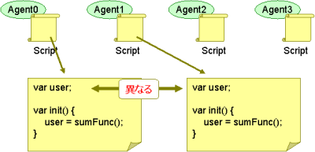
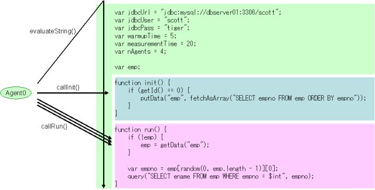

スクリプトの書き方
==================

JdbcRunnerでは負荷テストのシナリオをスクリプトで記述します。この章ではスクリプトの書き方について説明します。

JavaScriptとMozilla Rhinoの基礎
-------------------------------

JdbcRunnerではJavaScriptを用いてテストシナリオを記述します。JavaScriptの実装としては、 `Mozilla Rhino <https://github.com/mozilla/rhino>`_ を利用しています。

Mozilla RhinoのライブラリはJdbcRunnerのJARファイルに組み込まれているので、以下のコマンドでJavaScriptの動作確認をすることができます。JdbcRunnerを動かすためであれば変数の扱い方、if文、それからfor文の文法を覚えておけばさしあたりは十分かと思います。 ::

  shell> export CLASSPATH=jdbcrunner-1.3.jar
  shell> java org.mozilla.javascript.tools.shell.Main

  js> var a = 1
  js> var b = 2
  js> a + b
  3.0

  js> if (a < 2) { b = 10 } else { b = 20 }
  10.0

  js> var sum = 0
  js> for (var i = 1; i <= 100; i++) { sum += i }
  5050.0

ウェブブラウザで用いられるdocumentオブジェクトなどはありません。 ::

  js> document.write("test")
  script error: sun.org.mozilla.javascript.internal.EcmaError:
  ReferenceError: "document" is not defined. (<STDIN>#1) in <STDIN> at line number 1

Mozilla Rhinoの便利なところとして、JavaScriptからJavaのクラスを呼び出す機能があります。以下はJavaのコレクションクラスを利用する例です。 ::

  js> var map = new java.util.HashMap()
  js> map.put("7788", "scott")
  js> map.put("7839", "king")

  js> map.get("7788")
  scott

  js> map.keySet()
  [7839, 7788]

スクリプト環境はエージェントごとに独立
--------------------------------------

JdbcRunnerのエージェントは、それぞれが独立したスクリプト実行環境を持っています。

そのためあるエージェントでグローバル変数を更新しても、その内容は他のエージェントには見えません。スクリプトを作成する際は、この点に注意してプログラミングを行ってください。

エージェント間でデータを共有したい場合は、共有データをデータベースにINSERTしておくか、ツールが提供するputData()、getData()ファンクションを利用することができます。

スクリプトの構成ルール
----------------------

負荷シナリオのスクリプトを書くにあたっては、以下のルールがあります。

#. JdbcRunnerに設定するパラメータがある場合、パラメータをグローバル変数として宣言する
#. トップレベルのスコープにロジックを書かない
#. 初期化処理をinit()、測定時に行う処理をrun()、終了処理をfin()ファンクションとして定義する。ただしinit()とfin()は省略可能

以下のサンプルを用いて説明します。 ::

  var jdbcUrl = "jdbc:mysql://dbserver01:3306/scott";
  var jdbcUser = "scott";
  var jdbcPass = "tiger";
  var warmupTime = 5;
  var measurementTime = 20;
  var nAgents = 4;

  var emp;

  function init() {
      if (getId() == 0) {
          putData("emp", fetchAsArray("SELECT empno FROM emp ORDER BY empno"));
      }
  }

  function run() {
      if (!emp) {
          emp = getData("emp");
      }

      var empno = emp[random(0, emp.length - 1)][0];
      query("SELECT ename FROM emp WHERE empno = $int", empno);
  }

パラメータをグローバル変数として宣言する
^^^^^^^^^^^^^^^^^^^^^^^^^^^^^^^^^^^^^^^^

JdbcRunnerでは設定パラメータをコマンドラインオプションで指定するほかに、特定のグローバル変数を宣言することでも行うことができます。 ::

  var jdbcUrl = "jdbc:mysql://dbserver01:3306/scott";
  var jdbcUser = "scott";
  var jdbcPass = "tiger";
  var warmupTime = 5;
  var measurementTime = 20;
  var nAgents = 4;

これはコマンドラインに以下のオプションを設定することと同じです。 ::

  shell> java JR test.js -jdbcUrl jdbc:mysql://dbserver01:3306/scott
                         -jdbcUser scott
                         -jdbcPass tiger
                         -warmupTime 5
                         -measurementTime 20
                         -nAgents 4

グローバル変数とコマンドラインオプションを両方設定した場合は、コマンドラインオプションの設定が優先されます。固定的なパラメータをスクリプト内で設定しておくと便利です。

また、設定パラメータと関係ないグローバル変数を宣言しても特に問題はありません。ただし、変数名が設定パラメータ名と重複しないように注意してください。 ::

  var emp;

トップレベルのスコープにロジックを書かない
^^^^^^^^^^^^^^^^^^^^^^^^^^^^^^^^^^^^^^^^^^

スクリプトを作成する際は、トップレベルのスコープになるべく処理を書かないようにしてください。JdbcRunnerは最初にスクリプトをコンパイルしますが、その際にトップレベルのスコープに書いたロジックが実行されます。この時点ではデータベースにまだ接続していないので、データベース操作を行おうとするとエラーになります。

エージェントがスクリプトにアクセスするパターンを図にすると以下のようになります。

処理内容をinit()、run()、fin()ファンクションとして定義する
^^^^^^^^^^^^^^^^^^^^^^^^^^^^^^^^^^^^^^^^^^^^^^^^^^^^^^^^^^

初期化処理をinit()、測定時に行う処理をrun()、終了処理をfin()ファンクションとして定義します。init()とfin()は省略しても構いません。以下はinit()とrun()のみを定義する例です。 ::

  function init() {
      if (getId() == 0) {
          putData("emp", fetchAsArray("SELECT empno FROM emp ORDER BY empno"));
      }
  }

  function run() {
      if (!emp) {
          emp = getData("emp");
      }

      var empno = emp[random(0, emp.length - 1)][0];
      query("SELECT ename FROM emp WHERE empno = $int", empno);
  }

JavaScriptそのものにはデータベースアクセス機能はありませんので、ツール側でquery()、commit()などの独自ファンクションを用意しています。これらのファンクションを利用して処理を組み立てていきます。

スクリプトのテンプレート
------------------------

スクリプトのテンプレートをscripts/template.jsに用意してあります。最初はこれをコピーして利用すると便利です。 ::

  /*
   * JdbcRunner script template
   */

  // JdbcRunner settings -----------------------------------------------

  // Oracle Database
  // var jdbcUrl = "jdbc:oracle:thin://@localhost:1521/orcl.local";

  // MySQL
  var jdbcUrl = "jdbc:mysql://localhost:3306/test";

  // PostgreSQL
  // var jdbcUrl = "jdbc:postgresql://localhost:5432/postgres";

  var jdbcDriver = "";
  var jdbcUser = "";
  var jdbcPass = "";
  var isLoad = false;
  var warmupTime = 10;
  var measurementTime = 60;
  var nTxTypes = 1;
  var nAgents = 1;
  var connPoolSize = nAgents;
  var stmtCacheSize = 10;
  var isAutoCommit = true;
  var sleepTime = 0;
  var throttle = 0;
  var isDebug = false;
  var isTrace = false;
  var logDir = ".";

  // Application settings ----------------------------------------------

  // JdbcRunner functions ----------------------------------------------

  function init() {
      if (getId() == 0) {
          // This block is performed only by Agent 0.
      }
  }

  function run() {
  }

  function fin() {
      if (getId() == 0) {
          // This block is performed only by Agent 0.
      }
  }

  // Application functions ---------------------------------------------
