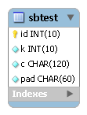

テストキット Tiny SysBench
==========================

SysBenchとは
------------

`SysBench <http://sysbench.sourceforge.net/>`_ はAlexey Kopytov氏によってメンテナンスされているオープンソースソフトウェアで、以下の5種類のテストを行うことができる総合的なベンチマークツールです。ライセンスはGPLv2です。

* file I/O performance
* scheduler performance
* memory allocation and transfer speed
* POSIX threads implementation performance
* database server performance (OLTP benchmark)

OLTPベンチマークで用いられるデータベースのER図を以下に示します。テーブルは一つだけで、ごく単純な作りとなっています。

OLTPベンチマークは以下の4種類のテストモードを備えています。

* simple : 主キーによる一意検索を行う
* complex : 主キーによる一意検索、範囲検索、集計処理など9種類のクエリを実行する
* nontrx : トランザクションを使わずに5種類のクエリを実行する
* sp : ユーザが用意したストアドプロシージャを実行する

complexモードで実行されるトランザクションの内容は以下のとおりです。主キーによる一意検索が10回、その他8種類のクエリは1回ずつ実行されます。この比率はカスタマイズ可能となっています。 ::

  SELECT c FROM sbtest WHERE id = :1;
  SELECT c FROM sbtest WHERE id = :1;
  SELECT c FROM sbtest WHERE id = :1;
  SELECT c FROM sbtest WHERE id = :1;
  SELECT c FROM sbtest WHERE id = :1;
  SELECT c FROM sbtest WHERE id = :1;
  SELECT c FROM sbtest WHERE id = :1;
  SELECT c FROM sbtest WHERE id = :1;
  SELECT c FROM sbtest WHERE id = :1;
  SELECT c FROM sbtest WHERE id = :1;
  SELECT c FROM sbtest WHERE id BETWEEN :1 AND :2;
  SELECT SUM(k) FROM sbtest WHERE id BETWEEN :1 AND :2;
  SELECT c FROM sbtest WHERE id BETWEEN :1 AND :2 ORDER BY c;
  SELECT DISTINCT c FROM sbtest WHERE id BETWEEN :1 AND :2 ORDER BY c;
  UPDATE sbtest SET k = k + 1 WHERE id = :1;
  UPDATE sbtest SET c = :1 WHERE id = :2;
  DELETE FROM sbtest WHERE id = :1;
  INSERT INTO sbtest (id, k, c, pad) VALUES (:1, :2, :3, :4);
  COMMIT;

SysBenchのOLTPベンチマークはMySQLをターゲットとして開発されていますが、Oracle DatabaseとPostgreSQLにも対応しています。

Tiny SysBenchとは
-----------------

Tiny SysBenchは、SysBenchのOLTPベンチマークのうちcomplexモードをJdbcRunner上に移植したものです。以下の二つのスクリプトから構成されています。

* scripts/sysbench_load.js : テストデータ生成用スクリプト
* scripts/sysbench.js : テスト用スクリプト

対応RDBMS
---------

Tiny SysBenchは以下のRDBMSに対応しています。

* Oracle Database 11g Release 2
* MySQL 5.1、5.5
* PostgreSQL 8.4、9.0、9.1

RDBMSのバージョンは実際に動作確認を行ったバージョンを示しており、これ以外のバージョンでも動作する可能性はあります。

テストの準備
------------

MySQLにおけるテストの準備手順を以下に示します。Oracle Database、PostgreSQLについてはscripts/sysbench_load.jsのコメントをご参照ください。

ユーザの作成
^^^^^^^^^^^^

MySQLにrootユーザで接続し、sbtestユーザを作成します。 ::

  > mysql -u root -p
  
  mysql> CREATE USER sbtest@'%' IDENTIFIED BY 'sbtest';
  Query OK, 0 rows affected (0.00 sec)

  mysql> GRANT ALL PRIVILEGES ON sbtest.* TO sbtest@'%';
  Query OK, 0 rows affected (0.00 sec)

ネットワーク環境によっては、接続元ホストを制限したりsbtestをより安全なパスワードに変更することをおすすめします。

データベースの作成
^^^^^^^^^^^^^^^^^^

sbtestデータベースを作成します。 ::

  mysql> CREATE DATABASE sbtest;
  Query OK, 1 row affected (0.00 sec)

テストデータの生成
^^^^^^^^^^^^^^^^^^

scripts/sysbench_load.jsを用いてテストデータの生成を行います。このスクリプトは以下の処理を行っています。

* テーブルの削除
* テーブルの作成
* データロード
* インデックスの作成 (MySQLのみデータロード前に作成)
* 統計情報の更新 (Oracle Database、PostgreSQLのみ実施)

::

  > java JR scripts\sysbench_load.js
  
  01:41:56 [INFO ] > JdbcRunner 1.2
  01:41:56 [INFO ] [Config]
  Program start time   : 20111011-014156
  Script filename      : scripts\sysbench_load.js
  JDBC driver          : -
  JDBC URL             : jdbc:mysql://localhost:3306/sbtest?useSSL=false&allowPublicKeyRetrieval=true&rewriteBatchedStatements=true
  JDBC user            : sbtest
  Load mode            : true
  Number of agents     : 1
  Auto commit          : false
  Debug mode           : false
  Trace mode           : false
  Log directory        : logs
  Parameter 0          : 0
  Parameter 1          : 0
  Parameter 2          : 0
  Parameter 3          : 0
  Parameter 4          : 0
  Parameter 5          : 0
  Parameter 6          : 0
  Parameter 7          : 0
  Parameter 8          : 0
  Parameter 9          : 0
  01:41:56 [INFO ] Tiny SysBench 1.0 - data loader
  01:41:56 [INFO ] -param0 : Number of records (default : 10000)
  01:41:56 [INFO ] Number of records : 10000
  01:41:56 [INFO ] Dropping a table ...
  01:41:56 [WARN ] JavaException: com.mysql.jdbc.exceptions.jdbc4.MySQLSyntaxErrorException: Unknown table 'sbtest'
  01:41:56 [INFO ] Creating a table ...
  01:41:56 [INFO ] Loading sbtest ...
  01:41:57 [INFO ] sbtest : 1000 / 10000
  01:41:57 [INFO ] sbtest : 2000 / 10000
  01:41:57 [INFO ] sbtest : 3000 / 10000
  01:41:57 [INFO ] sbtest : 4000 / 10000
  01:41:57 [INFO ] sbtest : 5000 / 10000
  01:41:57 [INFO ] sbtest : 6000 / 10000
  01:41:57 [INFO ] sbtest : 7000 / 10000
  01:41:57 [INFO ] sbtest : 8000 / 10000
  01:41:57 [INFO ] sbtest : 9000 / 10000
  01:41:57 [INFO ] sbtest : 10000 / 10000
  01:41:57 [INFO ] Completed.
  01:41:57 [INFO ] < JdbcRunner SUCCESS

「Unknown table 'sbtest'」という警告は、存在しないsbtestテーブルを削除しようとして出力されるものです。無視して構いません。

また、-param0を指定することによってsbtestテーブルにロードするレコード数を変更することが可能です。デフォルトは1万レコードとなっています。 ::

  > java JR scripts\sysbench_load.js -param0 50000

テストの実行
------------

scripts/sysbench.jsを用いてテストを実行します。JdbcRunnerを動作させるマシンは、テスト対象のマシンとは別に用意することを強くおすすめします。

Oracle Java SE/OpenJDKを利用する際は、Server VMを用いることをおすすめします。詳細は `JDK 6 仮想マシン (VM) 関連 API & 開発者ガイド <http://java.sun.com/javase/ja/6/docs/ja/technotes/guides/vm/index.html>`_ をご参照ください。 ::

  > java -server JR scripts\sysbench.js -jdbcUrl jdbc:mysql://server/sbtest?useSSL=false&allowPublicKeyRetrieval=true
  
  02:19:12 [INFO ] > JdbcRunner 1.2
  02:19:12 [INFO ] [Config]
  Program start time   : 20111011-021911
  Script filename      : scripts\sysbench.js
  JDBC driver          : -
  JDBC URL             : jdbc:mysql://server/sbtest?useSSL=false&allowPublicKeyRetrieval=true
  JDBC user            : sbtest
  Warmup time          : 60 sec
  Measurement time     : 180 sec
  Number of tx types   : 1
  Number of agents     : 16
  Connection pool size : 16
  Statement cache size : 20
  Auto commit          : false
  Sleep time           : 0 msec
  Throttle             : - tps
  Debug mode           : false
  Trace mode           : false
  Log directory        : logs
  Parameter 0          : 0
  Parameter 1          : 0
  Parameter 2          : 0
  Parameter 3          : 0
  Parameter 4          : 0
  Parameter 5          : 0
  Parameter 6          : 0
  Parameter 7          : 0
  Parameter 8          : 0
  Parameter 9          : 0
  02:19:13 [INFO ] Tiny SysBench 1.0
  02:19:13 [INFO ] Number of records : 10000
  02:19:14 [INFO ] [Warmup] -59 sec, 150 tps, (150 tx)
  02:19:15 [INFO ] [Warmup] -58 sec, 241 tps, (391 tx)
  02:19:16 [INFO ] [Warmup] -57 sec, 268 tps, (659 tx)
  02:19:17 [WARN ] [Agent 7] Deadlock detected.
  02:19:17 [INFO ] [Warmup] -56 sec, 368 tps, (1027 tx)
  02:19:18 [WARN ] [Agent 0] Deadlock detected.
  02:19:18 [INFO ] [Warmup] -55 sec, 370 tps, (1397 tx)
  ...
  02:23:09 [INFO ] [Progress] 176 sec, 379 tps, 67112 tx
  02:23:10 [INFO ] [Progress] 177 sec, 353 tps, 67465 tx
  02:23:11 [INFO ] [Progress] 178 sec, 370 tps, 67835 tx
  02:23:12 [INFO ] [Progress] 179 sec, 355 tps, 68190 tx
  02:23:13 [INFO ] [Progress] 180 sec, 376 tps, 68566 tx
  02:23:13 [INFO ] [Total tx count] 68565 tx
  02:23:13 [INFO ] [Throughput] 380.9 tps
  02:23:13 [INFO ] [Response time (minimum)] 21 msec
  02:23:13 [INFO ] [Response time (50%tile)] 40 msec
  02:23:13 [INFO ] [Response time (90%tile)] 53 msec
  02:23:13 [INFO ] [Response time (95%tile)] 58 msec
  02:23:13 [INFO ] [Response time (99%tile)] 71 msec
  02:23:13 [INFO ] [Response time (maximum)] 449 msec
  02:23:13 [INFO ] < JdbcRunner SUCCESS

OLTPベンチマークのcomplexモードでは、デッドロックが発生することがあります。これはオリジナル版のSysBenchでも発生するものです。Tiny SysBenchはデッドロックが発生した場合、該当のトランザクションをロールバックして再度実行します。

テストのカスタマイズ
--------------------

Tiny SysBenchはスクリプトscripts/sysbench.jsの変数定義を修正することで、オリジナル版のSysBenchが持つ設定オプションをある程度再現することができます。変数はスクリプトのApplication settingsという箇所に定義されていますので、ここを修正してご利用ください。 ::

  // Application settings ----------------------------------------------
  
  var DIST_UNIFORM = 1;
  var DIST_GAUSSIAN = 2;
  var DIST_SPECIAL = 3;
  
  // Number of records in the test table
  var oltpTableSize;
  
  // Ratio of queries in a transaction
  var oltpPointSelects = 10;
  var oltpSimpleRanges = 1;
  var oltpSumRanges = 1;
  var oltpOrderRanges = 1;
  var oltpDistinctRanges = 1;
  var oltpIndexUpdates = 1;
  var oltpNonIndexUpdates = 1;
  
  // Read-only flag
  var oltpReadOnly = false;
  
  // Range size for range queries
  var oltpRangeSize = 100;
  
  // Parameters for random numbers distribution
  var oltpDistType = DIST_SPECIAL;
  var oltpDistIter = 12;
  var oltpDistPct = 1;
  var oltpDistRes = 75;

オリジナル版SysBenchとの対応表を以下に示します。

====================== =================== ====================================================================
SysBenchのオプション   sysbench.jsの変数   説明
====================== =================== ====================================================================
oltp-test-mode         (未対応)            テストモードを指定するオプションです
oltp-reconnect-mode    (未対応)            テスト中にデータベースに再接続する方式を指定するオプションです
oltp-sp-name           (未対応)            spモードで実行するストアドプロシージャを指定するオプションです
oltp-read-only         oltpReadOnly        SELECT文のみを実行するオプションです
oltp-skip-trx          (未対応)            BEGIN/COMMIT文をスキップするオプションです
oltp-range-size        oltpRangeSize       範囲検索クエリの検索範囲を指定するオプションです
oltp-point-selects     oltpPointSelects    一意検索クエリの回数を指定するオプションです
oltp-simple-ranges     oltpSimpleRanges    範囲検索クエリの回数を指定するオプションです
oltp-sum-ranges        oltpSumRanges       範囲検索して集計するクエリの回数を指定するオプションです
oltp-order-ranges      oltpOrderRanges     範囲検索してソートするクエリの回数を指定するオプションです
oltp-distinct-ranges   oltpDistinctRanges  範囲検索して重複を省くクエリの回数を指定するオプションです
oltp-index-updates     oltpIndexUpdates    インデックス付き列を更新するクエリの回数を指定するオプションです
oltp-non-index-updates oltpNonIndexUpdates インデックスなし列を更新するクエリの回数を指定するオプションです
oltp-nontrx-mode       (未対応)            nontrxモードで実行するクエリを指定するオプションです
oltp-auto-inc          (未対応)            ID列にAUTO_INCREMENTを用いるかどうかを指定するオプションです
oltp-connect-delay     (未対応)            データベースに接続した後のスリープ時間を指定するオプションです
oltp-user-delay-min    (未対応)            クエリごとのスリープ時間の最小値を指定するオプションです
oltp-user-delay-max    (未対応)            クエリごとのスリープ時間の最大値を指定するオプションです
oltp-table-name        (未対応)            テストに用いるテーブル名を指定するオプションです
oltp-table-size        (ローダで指定)      テストに用いるテーブルのレコード数を指定するオプションです
oltp-dist-type         oltpDistType        乱数生成方式を指定するオプションです
oltp-dist-iter         oltpDistIter        ガウス分布乱数を生成するための加算回数を指定するオプションです
oltp-dist-pct          oltpDistPct         特殊分布乱数において、均一分布乱数の生成範囲を指定するオプションです
oltp-dist-res          oltpDistRes         特殊分布乱数において、均一分布乱数の発生確率を指定するオプションです
====================== =================== ====================================================================
