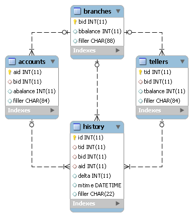

テストキット Tiny TPC-B
=======================

TPC-Bとは
---------

`TPC-B <http://www.tpc.org/tpcb/>`_ とは、 `TPC <http://www.tpc.org/>`_ によって策定されたベンチマーク仕様の一つです。銀行の窓口業務をモデルにしたトランザクションを実行し、システムの性能を測定します。データベースのER図を以下に示します。

* branches : 銀行の支店を表しています。このテーブルのレコード数がデータベース全体の規模を決めるスケールファクタになっています。
* tellers : 銀行員を表しています。支店あたり10名の銀行員がいます。
* accounts : 銀行口座を表しています。支店あたり10万の口座があります。
* history : 取引履歴を表しています。

TPC-Bでは1種類のトランザクションが定義されています。これは以下のSQLを順番に発行するものです。 ::

  UPDATE accounts SET abalance = abalance + :1 WHERE aid = :2;
  SELECT abalance FROM accounts WHERE aid = :1;
  UPDATE tellers SET tbalance = abalance + :1 WHERE aid = :2;
  UPDATE branches SET bbalance = abalance + :1 WHERE aid = :2;
  INSERT INTO history (aid, aid, aid, delta) VALUES (:1, :2, :3, :4);
  COMMIT;

TPC-BのCRUD図を以下に示します。TPC-Bには更新の割合が非常に高いという特徴があります。

=========== ======== ======= ======== =======
Transaction branches tellers accounts history
=========== ======== ======= ======== =======
TPC-B       U        U       RU       C
=========== ======== ======= ======== =======

Tiny TPC-Bとは
--------------

Tiny TPC-Bは、TPC-B Standard Specification 2.0の仕様を抜粋しJdbcRunnerのスクリプトとして実装したものです。仕様書のうち以下の章節を実装しています。

* 1 Transaction Profile
  
  * 1.2 The Transaction Profile
  
* 3 Logical Database Design
* 4 Scaling Rules
* 5 Distribution, Partitioning, and Transaction Generation

それ以外の章節については実装されていないか、仕様を満たしていません。従ってTiny TPC-Bのテスト結果は正式なTPC-Bのスコアではありません。

Tiny TPC-Bは以下の二つのスクリプトから構成されています。

* scripts/tpcb_load.js : テストデータ生成用スクリプト
* scripts/tpcb.js : テスト用スクリプト

対応RDBMS
---------

Tiny TPC-Bは以下のRDBMSに対応しています。

* Oracle Database 11g Release 2
* MySQL 5.1、5.5
* PostgreSQL 8.4、9.0、9.1

RDBMSのバージョンは実際に動作確認を行ったバージョンを示しており、これ以外のバージョンでも動作する可能性はあります。

テストの準備
------------

MySQLにおけるテストの準備手順を以下に示します。Oracle Database、PostgreSQLについてはscripts/tpcb_load.jsのコメントをご参照ください。

ユーザの作成
^^^^^^^^^^^^

MySQLにrootユーザで接続し、tpcbユーザを作成します。 ::

  > mysql -u root
  
  mysql> GRANT ALL PRIVILEGES ON tpcb.* TO tpcb@'%' IDENTIFIED BY 'tpcb';
  Query OK, 0 rows affected (0.00 sec)

ネットワーク環境によっては、接続元ホストを制限したりtpcbをより安全なパスワードに変更することをおすすめします。

データベースの作成
^^^^^^^^^^^^^^^^^^

tpcbデータベースを作成します。 ::

  mysql> CREATE DATABASE tpcb;
  Query OK, 1 row affected (0.00 sec)

テストデータの生成
^^^^^^^^^^^^^^^^^^

scripts/tpcb_load.jsを用いてテストデータの生成を行います。このスクリプトは以下の処理を行っています。

* テーブルの削除
* テーブルの作成
* データロード
* インデックスの作成 (MySQLのみデータロード前に作成)
* 統計情報の更新 (Oracle Database、PostgreSQLのみ実施)

::

  > java JR scripts\tpcb_load.js
  
  02:35:34 [INFO ] > JdbcRunner 1.2
  02:35:34 [INFO ] [Config]
  Program start time   : 20111011-023534
  Script filename      : scripts\tpcb_load.js
  JDBC driver          : -
  JDBC URL             : jdbc:mysql://localhost:3306/tpcb?rewriteBatchedStatements=true
  JDBC user            : tpcb
  Load mode            : true
  Number of agents     : 4
  Auto commit          : false
  Debug mode           : false
  Trace mode           : false
  Log directory        : logs
  Parameter 0          : 0
  Parameter 1          : 0
  Parameter 2          : 0
  Parameter 3          : 0
  Parameter 4          : 0
  Parameter 5          : 0
  Parameter 6          : 0
  Parameter 7          : 0
  Parameter 8          : 0
  Parameter 9          : 0
  02:35:35 [INFO ] Tiny TPC-B 1.1 - data loader
  02:35:35 [INFO ] -param0  : Scale factor (default : 16)
  02:35:35 [INFO ] -nAgents : Parallel loading degree (default : 4)
  02:35:35 [INFO ] Scale factor            : 16
  02:35:35 [INFO ] Parallel loading degree : 4
  02:35:35 [INFO ] Dropping tables ...
  02:35:35 [WARN ] JavaException: com.mysql.jdbc.exceptions.jdbc4.MySQLSyntaxErrorException: Unknown table 'history'
  02:35:35 [WARN ] JavaException: com.mysql.jdbc.exceptions.jdbc4.MySQLSyntaxErrorException: Unknown table 'accounts'
  02:35:35 [WARN ] JavaException: com.mysql.jdbc.exceptions.jdbc4.MySQLSyntaxErrorException: Unknown table 'tellers'
  02:35:35 [WARN ] JavaException: com.mysql.jdbc.exceptions.jdbc4.MySQLSyntaxErrorException: Unknown table 'branches'
  02:35:35 [INFO ] Creating tables ...
  02:35:35 [INFO ] Loading branch id 1 by agent 1 ...
  02:35:35 [INFO ] Loading branch id 2 by agent 2 ...
  02:35:35 [INFO ] Loading branch id 3 by agent 0 ...
  02:35:35 [INFO ] Loading branch id 4 by agent 3 ...
  02:35:44 [INFO ] Loading branch id 5 by agent 1 ...
  02:35:56 [INFO ] Loading branch id 6 by agent 3 ...
  02:36:04 [INFO ] Loading branch id 7 by agent 0 ...
  02:36:04 [INFO ] Loading branch id 8 by agent 2 ...
  02:36:10 [INFO ] Loading branch id 9 by agent 3 ...
  02:36:10 [INFO ] Loading branch id 10 by agent 1 ...
  02:36:13 [INFO ] Loading branch id 11 by agent 2 ...
  02:36:15 [INFO ] Loading branch id 12 by agent 0 ...
  02:36:19 [INFO ] Loading branch id 13 by agent 1 ...
  02:36:20 [INFO ] Loading branch id 14 by agent 3 ...
  02:36:23 [INFO ] Loading branch id 15 by agent 2 ...
  02:36:26 [INFO ] Loading branch id 16 by agent 0 ...
  02:36:53 [INFO ] Completed.
  02:36:53 [INFO ] < JdbcRunner SUCCESS

「Unknown table 'history'」などの警告は、存在しないテーブルを削除しようとして出力されるものです。無視して構いません。

-param0を指定することによって、スケールファクタを変更することが可能です。スケールファクタ1あたり、branchesテーブルが1レコード、tellersテーブルが10レコード、accountsテーブルが10万レコード増加します。デフォルトのスケールファクタは16です。

-nAgentsを指定することによって、ロードの並列度を変更することが可能です。RDBMSがCPUスケーラビリティに優れておりクアッドコアなどCPUコア数の多い環境では、並列度を上げることでロード時間を短縮することができます。デフォルトの並列度は4です。 ::

  > java JR scripts\tpcb_load.js -nAgents 8 -param0 100

テストの実行
------------

scripts/tpcb.jsを用いてテストを実行します。JdbcRunnerを動作させるマシンは、テスト対象のマシンとは別に用意することを強くおすすめします。

Oracle Java SE/OpenJDKを利用する際は、Server VMを用いることをおすすめします。詳細は `JDK 6 仮想マシン (VM) 関連 API & 開発者ガイド <http://java.sun.com/javase/ja/6/docs/ja/technotes/guides/vm/index.html>`_ をご参照ください。 ::

  > java -server JR scripts\tpcb.js -jdbcUrl jdbc:mysql://server/tpcb
  
  02:40:05 [INFO ] > JdbcRunner 1.2
  02:40:05 [INFO ] [Config]
  Program start time   : 20111011-024004
  Script filename      : scripts\tpcb.js
  JDBC driver          : -
  JDBC URL             : jdbc:mysql://server/tpcb
  JDBC user            : tpcb
  Warmup time          : 60 sec
  Measurement time     : 180 sec
  Number of tx types   : 1
  Number of agents     : 16
  Connection pool size : 16
  Statement cache size : 10
  Auto commit          : false
  Sleep time           : 0 msec
  Throttle             : - tps
  Debug mode           : false
  Trace mode           : false
  Log directory        : logs
  Parameter 0          : 0
  Parameter 1          : 0
  Parameter 2          : 0
  Parameter 3          : 0
  Parameter 4          : 0
  Parameter 5          : 0
  Parameter 6          : 0
  Parameter 7          : 0
  Parameter 8          : 0
  Parameter 9          : 0
  02:40:06 [INFO ] Tiny TPC-B 1.1
  02:40:06 [INFO ] Scale factor : 16
  02:40:06 [INFO ] Truncating history table...
  02:40:07 [INFO ] [Warmup] -59 sec, 659 tps, (659 tx)
  02:40:08 [INFO ] [Warmup] -58 sec, 759 tps, (1418 tx)
  02:40:09 [INFO ] [Warmup] -57 sec, 933 tps, (2351 tx)
  02:40:10 [INFO ] [Warmup] -56 sec, 1248 tps, (3599 tx)
  02:40:11 [INFO ] [Warmup] -55 sec, 1291 tps, (4890 tx)
  ...
  02:44:02 [INFO ] [Progress] 176 sec, 1518 tps, 216989 tx
  02:44:03 [INFO ] [Progress] 177 sec, 730 tps, 217719 tx
  02:44:04 [INFO ] [Progress] 178 sec, 1725 tps, 219444 tx
  02:44:05 [INFO ] [Progress] 179 sec, 785 tps, 220229 tx
  02:44:06 [INFO ] [Progress] 180 sec, 1436 tps, 221665 tx
  02:44:06 [INFO ] [Total tx count] 221663 tx
  02:44:06 [INFO ] [Throughput] 1231.5 tps
  02:44:06 [INFO ] [Response time (minimum)] 4 msec
  02:44:06 [INFO ] [Response time (50%tile)] 10 msec
  02:44:06 [INFO ] [Response time (90%tile)] 18 msec
  02:44:06 [INFO ] [Response time (95%tile)] 22 msec
  02:44:06 [INFO ] [Response time (99%tile)] 41 msec
  02:44:06 [INFO ] [Response time (maximum)] 821 msec
  02:44:06 [INFO ] < JdbcRunner SUCCESS
