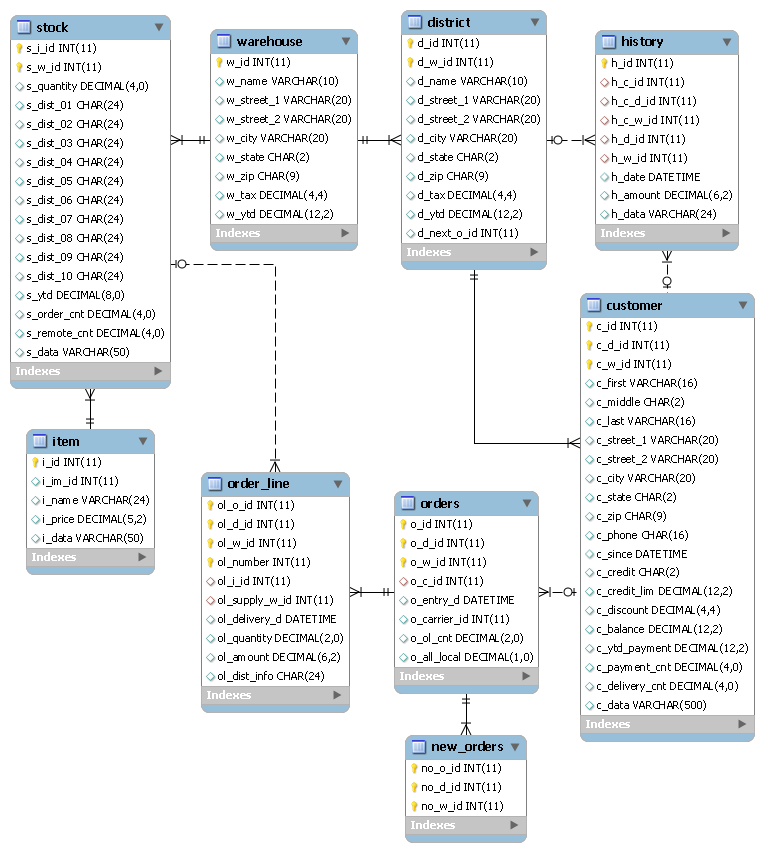

テストキット Tiny TPC-C
=======================

TPC-Cとは
---------

`TPC-C <http://www.tpc.org/tpcc/>`_ とは、 `TPC <http://www.tpc.org/>`_ によって策定されたベンチマーク仕様の一つです。卸売業における注文・支払いなどの業務をモデルにしたトランザクションを実行し、システムの性能を測定します。データベースのER図を以下に示します。

* warehouse : 倉庫を表しています。このテーブルのレコード数がデータベース全体の規模を決めるスケールファクタになっています。
* district : 配送区域を表しています。倉庫あたり10の配送区域があります。
* customer : 顧客を表しています。配送区域あたり3,000の顧客がいます。
* history : 支払い履歴を表しています。初期値として顧客あたり1件の支払い履歴があり、支払いを行うと増加していきます。
* item : 商品を表しています。このテーブルのレコード数は10万で固定されています。
* stock : 在庫を表しています。倉庫あたり10万の在庫データを持っています。
* orders : 注文を表しています。初期値として顧客あたり1つの注文があり、注文を行うと増加していきます。
* order_line : 注文明細を表しています。注文あたり平均10件の注文明細が作られます。
* new_orders : 未配送の新規注文を表しています。初期値として30%の顧客が1件ずつ未配送の新規注文を抱えており、注文を行うと増加し、配送が行われると減少します。

TPC-Cでは5種類のトランザクションが定義されています。5種類のトランザクションの実行比率は10:10:1:1:1となっています。

* New-Order : 注文処理です。
* Payment : 支払い処理です
* Order-Status : 注文状況を確認する処理です。
* Delivery : 配送処理です。
* Stock-Level : 在庫状況を確認する処理です。

New-Orderトランザクションの内容を擬似コードで表すと、以下のようになります。 ::

  SELECT FROM warehouse JOIN customer;
  SELECT FROM district FOR UPDATE;
  UPDATE district;
  INSERT INTO orders;
  INSERT INTO new_orders;
  
  LOOP {
    SELECT FROM item;
    SELECT FROM stock FOR UPDATE;
    UPDATE stock;
    INSERT INTO order_line;
  }
  
  COMMIT;

同様に、Paymentトランザクションの内容を以下に示します。 ::

  SELECT FROM warehouse FOR UPDATE;
  UPDATE warehouse;
  SELECT FROM district FOR UPDATE;
  UPDATE district;
  SELECT FROM customer;
  SELECT FROM customer FOR UPDATE;
  UPDATE customer;
  INSERT INTO history;
  COMMIT;

Order-Statusトランザクションの内容を以下に示します。 ::

  SELECT FROM customer;
  SELECT FROM customer;
  SELECT FROM orders WHERE id = (SELECT MAX(id) FROM orders);
  SELECT FROM order_line;
  COMMIT;

Deliveryトランザクションの内容を以下に示します。 ::

  LOOP {
    SELECT FROM new_orders WHERE id = (SELECT MIN(id) FROM new_orders) FOR UPDATE;
    DELETE FROM new_orders;
    SELECT FROM orders FOR UPDATE;
    UPDATE orders;
    UPDATE order_line;
    SELECT FROM order_line;
    UPDATE customer;
  }
  
  COMMIT;

Stock-Levelトランザクションの内容を以下に示します。 ::

  SELECT FROM district JOIN order_line JOIN stock;
  COMMIT;

TPC-CのCRUD図を以下に示します。

============ ========= ======== ======== ======= ==== ===== ====== ========== ==========
Transaction  warehouse district customer history item stock orders new_orders order_line
============ ========= ======== ======== ======= ==== ===== ====== ========== ==========
New-Order    R         RU       R                R    RU    C      C          C
Payment      RU        RU       RU       C
Order-Status                    R                           R                 R
Delivery                        U                           RU     RD         RU
Stock-Level            R                              R                       R
============ ========= ======== ======== ======= ==== ===== ====== ========== ==========

Tiny TPC-Cとは
--------------

Tiny TPC-Cは、TPC-C Standard Specification 5.10.1の仕様を抜粋しJdbcRunnerのスクリプトとして実装したものです。仕様書のうち以下の章節を実装しています。

* 1 LOGICAL DATABASE DESIGN
* 2 TRANSACTION and TERMINAL PROFILES
  
  * 2.4 The New-Order Transaction (2.4.1.1、2.4.3を除く)
  * 2.5 The Payment Transaction (2.5.1.1、2.5.3を除く)
  * 2.6 The Order-Status Transaction (2.6.1.1、2.6.3を除く)
  * 2.7 The Delivery Transaction (2.7.1.1、2.7.2、2.7.3を除く)
  * 2.8 The Stock-Level Transaction (2.8.1、2.8.3を除く)
  
* 4 SCALING and DATABASE POPULATION
  
  * 4.3 Database Population
  
* 5 PERFORMANCE METRICS and RESPONSE TIME
  
  * 5.2 Pacing of Transactions by Emulated Users
    
    * 5.2.4 Regulation of Transaction Mix

それ以外の章節については実装されていないか、仕様を満たしていません。従ってTiny TPC-Cのテスト結果は正式なTPC-Cのスコアではありません。

Tiny TPC-Cは以下の二つのスクリプトから構成されています。

* scripts/tpcc_load.js : テストデータ生成用スクリプト
* scripts/tpcc.js : テスト用スクリプト

対応RDBMS
---------

Tiny TPC-Cは以下のRDBMSに対応しています。

* Oracle Database 11g Release 2
* MySQL 5.1、5.5
* PostgreSQL 8.4、9.0、9.1

RDBMSのバージョンは実際に動作確認を行ったバージョンを示しており、これ以外のバージョンでも動作する可能性はあります。

テストの準備
------------

MySQLにおけるテストの準備手順を以下に示します。Oracle Database、PostgreSQLについてはscripts/tpcc_load.jsのコメントをご参照ください。

ユーザの作成
^^^^^^^^^^^^

MySQLにrootユーザで接続し、tpccユーザを作成します。 ::

  > mysql -u root
  
  mysql> GRANT ALL PRIVILEGES ON tpcc.* TO tpcc@'%' IDENTIFIED BY 'tpcc';
  Query OK, 0 rows affected (0.00 sec)

ネットワーク環境によっては、接続元ホストを制限したりtpccをより安全なパスワードに変更することをおすすめします。

データベースの作成
^^^^^^^^^^^^^^^^^^

tpccデータベースを作成します。 ::

  mysql> CREATE DATABASE tpcc;
  Query OK, 1 row affected (0.00 sec)

テストデータの生成
^^^^^^^^^^^^^^^^^^

scripts/tpcc_load.jsを用いてテストデータの生成を行います。このスクリプトは以下の処理を行っています。

* テーブルの削除
* テーブルの作成
* データロード
* インデックスの作成 (MySQLのみデータロード前に作成)
* 統計情報の更新 (Oracle Database、PostgreSQLのみ実施)

::

  > java JR scripts\tpcc_load.js
  
  02:53:00 [INFO ] > JdbcRunner 1.2
  02:53:00 [INFO ] [Config]
  Program start time   : 20111011-025300
  Script filename      : scripts\tpcc_load.js
  JDBC driver          : -
  JDBC URL             : jdbc:mysql://localhost:3306/tpcc?useSSL=false&rewriteBatchedStatements=true
  JDBC user            : tpcc
  Load mode            : true
  Number of agents     : 4
  Auto commit          : false
  Debug mode           : false
  Trace mode           : false
  Log directory        : logs
  Parameter 0          : 0
  Parameter 1          : 0
  Parameter 2          : 0
  Parameter 3          : 0
  Parameter 4          : 0
  Parameter 5          : 0
  Parameter 6          : 0
  Parameter 7          : 0
  Parameter 8          : 0
  Parameter 9          : 0
  02:53:01 [INFO ] Tiny TPC-C 1.1 - data loader
  02:53:01 [INFO ] -param0  : Scale factor (default : 16)
  02:53:01 [INFO ] -nAgents : Parallel loading degree (default : 4)
  02:53:01 [INFO ] Scale factor            : 16
  02:53:01 [INFO ] Parallel loading degree : 4
  02:53:01 [INFO ] Dropping tables ...
  02:53:01 [WARN ] JavaException: com.mysql.jdbc.exceptions.jdbc4.MySQLSyntaxErrorException: Unknown table 'order_line'
  02:53:01 [WARN ] JavaException: com.mysql.jdbc.exceptions.jdbc4.MySQLSyntaxErrorException: Unknown table 'new_orders'
  02:53:01 [WARN ] JavaException: com.mysql.jdbc.exceptions.jdbc4.MySQLSyntaxErrorException: Unknown table 'orders'
  02:53:01 [WARN ] JavaException: com.mysql.jdbc.exceptions.jdbc4.MySQLSyntaxErrorException: Unknown table 'stock'
  02:53:01 [WARN ] JavaException: com.mysql.jdbc.exceptions.jdbc4.MySQLSyntaxErrorException: Unknown table 'item'
  02:53:01 [WARN ] JavaException: com.mysql.jdbc.exceptions.jdbc4.MySQLSyntaxErrorException: Unknown table 'history'
  02:53:01 [WARN ] JavaException: com.mysql.jdbc.exceptions.jdbc4.MySQLSyntaxErrorException: Unknown table 'customer'
  02:53:01 [WARN ] JavaException: com.mysql.jdbc.exceptions.jdbc4.MySQLSyntaxErrorException: Unknown table 'district'
  02:53:01 [WARN ] JavaException: com.mysql.jdbc.exceptions.jdbc4.MySQLSyntaxErrorException: Unknown table 'warehouse'
  02:53:01 [INFO ] Creating tables ...
  02:53:01 [INFO ] Loading item ...
  02:53:02 [INFO ] item : 10000 / 100000
  02:53:03 [INFO ] item : 20000 / 100000
  02:53:03 [INFO ] item : 30000 / 100000
  02:53:04 [INFO ] item : 40000 / 100000
  02:53:05 [INFO ] item : 50000 / 100000
  02:53:05 [INFO ] item : 60000 / 100000
  02:53:06 [INFO ] item : 70000 / 100000
  02:53:07 [INFO ] item : 80000 / 100000
  02:53:07 [INFO ] item : 90000 / 100000
  02:53:08 [INFO ] item : 100000 / 100000
  02:53:08 [INFO ] Loading warehouse id 1 by agent 3 ...
  02:53:08 [INFO ] [Agent 3] Loading warehouse ...
  02:53:08 [INFO ] Loading warehouse id 2 by agent 1 ...
  02:53:08 [INFO ] [Agent 1] Loading warehouse ...
  02:53:08 [INFO ] Loading warehouse id 3 by agent 2 ...
  02:53:08 [INFO ] [Agent 2] Loading warehouse ...
  02:53:08 [INFO ] [Agent 1] Loading district ...
  02:53:08 [INFO ] [Agent 2] Loading district ...
  02:53:08 [INFO ] Loading warehouse id 4 by agent 0 ...
  02:53:08 [INFO ] [Agent 0] Loading warehouse ...
  02:53:08 [INFO ] [Agent 0] Loading district ...
  02:53:08 [INFO ] [Agent 3] Loading district ...
  02:53:08 [INFO ] [Agent 3] Loading customer and history ...
  02:53:08 [INFO ] [Agent 0] Loading customer and history ...
  02:53:08 [INFO ] [Agent 2] Loading customer and history ...
  02:53:08 [INFO ] [Agent 1] Loading customer and history ...
  02:53:21 [INFO ] [Agent 1] customer : 10000 / 30000
  02:53:21 [INFO ] [Agent 3] customer : 10000 / 30000
  02:53:22 [INFO ] [Agent 0] customer : 10000 / 30000
  02:53:23 [INFO ] [Agent 2] customer : 10000 / 30000
  ...
  03:12:22 [INFO ] [Agent 3] orders : 30000 / 30000
  03:12:33 [INFO ] [Agent 2] orders : 30000 / 30000
  03:12:34 [INFO ] [Agent 0] orders : 30000 / 30000
  03:12:38 [INFO ] [Agent 1] orders : 30000 / 30000
  03:12:38 [INFO ] Completed.
  03:12:38 [INFO ] < JdbcRunner SUCCESS

「Unknown table 'order_line'」などの警告は、存在しないテーブルを削除しようとして出力されるものです。無視して構いません。

-param0を指定することによって、スケールファクタを変更することが可能です。スケールファクタ1あたりwarehouseテーブルが1レコード増加し、その他のテーブルもレコード数が以下のように増加します。デフォルトのスケールファクタは16です。

========== ======================
Table      Records
========== ======================
warehouse  sf x 1
district   sf x 10
customer   sf x 30,000
history    sf x 30,000
item       100,000
stock      sf x 100,000
orders     sf x 30,000
new_orders sf x 9,000
order_line sf x 300,000 (approx.)
========== ======================

-nAgentsを指定することによって、ロードの並列度を変更することが可能です。RDBMSがCPUスケーラビリティに優れておりクアッドコアなどCPUコア数の多い環境では、並列度を上げることでロード時間を短縮することができます。デフォルトの並列度は4です。 ::

  > java JR scripts\tpcc_load.js -nAgents 8 -param0 100

テストの実行
------------

scripts/tpcc.jsを用いてテストを実行します。JdbcRunnerを動作させるマシンは、テスト対象のマシンとは別に用意することを強くおすすめします。

Oracle Java SE/OpenJDKを利用する際は、Server VMを用いることをおすすめします。詳細は `JDK 6 仮想マシン (VM) 関連 API & 開発者ガイド <http://java.sun.com/javase/ja/6/docs/ja/technotes/guides/vm/index.html>`_ をご参照ください。 ::

  > java -server JR scripts\tpcc.js -jdbcUrl jdbc:mysql://server/tpcc?useSSL=false
  
  03:14:51 [INFO ] > JdbcRunner 1.2
  03:14:51 [INFO ] [Config]
  Program start time   : 20111011-031451
  Script filename      : scripts\tpcc.js
  JDBC driver          : -
  JDBC URL             : jdbc:mysql://server/tpcc?useSSL=false
  JDBC user            : tpcc
  Warmup time          : 300 sec
  Measurement time     : 900 sec
  Number of tx types   : 5
  Number of agents     : 16
  Connection pool size : 16
  Statement cache size : 40
  Auto commit          : false
  Sleep time           : 0,0,0,0,0 msec
  Throttle             : - tps (total)
  Debug mode           : false
  Trace mode           : false
  Log directory        : logs
  Parameter 0          : 0
  Parameter 1          : 0
  Parameter 2          : 0
  Parameter 3          : 0
  Parameter 4          : 0
  Parameter 5          : 0
  Parameter 6          : 0
  Parameter 7          : 0
  Parameter 8          : 0
  Parameter 9          : 0
  03:14:53 [INFO ] Tiny TPC-C 1.1
  03:14:53 [INFO ] Scale factor : 16
  03:14:53 [INFO ] tx0 : New-Order transaction
  03:14:53 [INFO ] tx1 : Payment transaction
  03:14:53 [INFO ] tx2 : Order-Status transaction
  03:14:53 [INFO ] tx3 : Delivery transaction
  03:14:53 [INFO ] tx4 : Stock-Level transaction
  03:14:54 [INFO ] [Warmup] -299 sec, 29,51,7,2,4 tps, (29,51,7,2,4 tx)
  03:14:55 [INFO ] [Warmup] -298 sec, 25,21,2,4,2 tps, (54,72,9,6,6 tx)
  03:14:56 [INFO ] [Warmup] -297 sec, 77,64,7,7,6 tps, (131,136,16,13,12 tx)
  03:14:57 [INFO ] [Warmup] -296 sec, 81,87,7,5,7 tps, (212,223,23,18,19 tx)
  03:14:58 [INFO ] [Warmup] -295 sec, 102,86,10,12,13 tps, (314,309,33,30,32 tx)
  ...
  03:34:49 [INFO ] [Progress] 896 sec, 59,70,5,9,8 tps, 57542,57533,5755,5753,5754 tx
  03:34:50 [INFO ] [Progress] 897 sec, 65,65,4,8,5 tps, 57607,57598,5759,5761,5759 tx
  03:34:51 [INFO ] [Progress] 898 sec, 55,75,7,5,9 tps, 57662,57673,5766,5766,5768 tx
  03:34:52 [INFO ] [Progress] 899 sec, 54,47,10,5,4 tps, 57716,57720,5776,5771,5772 tx
  03:34:53 [INFO ] [Progress] 900 sec, 75,57,5,4,6 tps, 57791,57777,5781,5775,5778 tx
  03:34:53 [INFO ] [Total tx count] 57791,57777,5781,5775,5778 tx
  03:34:53 [INFO ] [Throughput] 64.2,64.2,6.4,6.4,6.4 tps
  03:34:53 [INFO ] [Response time (minimum)] 7,7,6,95,4 msec
  03:34:53 [INFO ] [Response time (50%tile)] 134,22,45,220,263 msec
  03:34:53 [INFO ] [Response time (90%tile)] 220,86,94,551,419 msec
  03:34:53 [INFO ] [Response time (95%tile)] 249,107,107,629,488 msec
  03:34:53 [INFO ] [Response time (99%tile)] 516,192,146,841,783 msec
  03:34:53 [INFO ] [Response time (maximum)] 1277,839,703,1359,1144 msec
  03:34:54 [INFO ] < JdbcRunner SUCCESS

TPC-Cには5種類のトランザクションが定義されていることから、Tiny TPC-Cではそれぞれを別のトランザクションとして集計しています。スループット、レスポンスタイムの出力はそれぞれ左からNew-Order、Payment、Order-Status、Delivery、Stock-Levelトランザクションのものを表しています。

TPC-CのスコアにはNew-Orderトランザクションの1分あたりの実行回数を用います。上記の例では15分間で57,791txですから、スコアは3,852.7tpmとなります。
